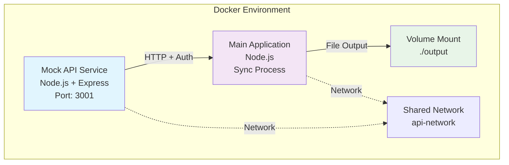

# Docker Setup Architecture

**Document Version:** 1.0
**Phase:** MVP - Docker Configuration
**Last Updated:** 2025-01-10

## Overview

This document describes the complete Docker architecture for the MVP, including service definitions, networking, authentication, and volume configuration.

## Architecture Design

### Service Architecture


## Project Structure

```
api-to-cdn-sync/
├── docker-compose.yml          # Service orchestration
├── mock-api/                   # Mock API service
│   ├── Dockerfile
│   ├── package.json
│   ├── server.js              # Express server with auth
│   └── data/
│       └── account-specs.json # Mock API response data
├── src/                       # Main application
│   ├── Dockerfile
│   ├── package.json
│   ├── fetcher.js             # HTTP client with auth
│   ├── transformer.js         # JSON → JS transformation
│   ├── main.js               # Orchestration script
│   └── config.json           # Application configuration
├── test/                      # Test files
│   ├── fetcher.test.js
│   ├── transformer.test.js
│   └── integration.test.js
└── output/                    # Generated files (volume mounted)
```

## Service Definitions

### 1. Mock API Service

**Purpose**: Simulate production API with proper authentication

#### Dockerfile (`mock-api/Dockerfile`)
```dockerfile
FROM node:18-alpine
WORKDIR /app

# Install dependencies
COPY package.json ./
RUN npm install --only=production

# Copy application code
COPY . .

# Expose port
EXPOSE 3001

# Health check
HEALTHCHECK --interval=30s --timeout=3s --start-period=5s --retries=3 \
  CMD curl -f http://localhost:3001/health || exit 1

# Start server
CMD ["node", "server.js"]
```

#### Package Configuration (`mock-api/package.json`)
```json
{
  "name": "mock-api-server",
  "version": "1.0.0",
  "description": "Mock API server for API-to-CDN sync testing",
  "main": "server.js",
  "dependencies": {
    "express": "^4.18.2",
    "cors": "^2.8.5"
  },
  "scripts": {
    "start": "node server.js",
    "dev": "nodemon server.js"
  }
}
```

#### Express Server (`mock-api/server.js`)
```javascript
const express = require('express');
const cors = require('cors');
const fs = require('fs');
const path = require('path');

const app = express();
const PORT = process.env.PORT || 3001;

// Middleware
app.use(cors());
app.use(express.json());

// Load mock data
const loadMockData = () => {
  try {
    const dataPath = path.join(__dirname, 'data', 'account-specs.json');
    return JSON.parse(fs.readFileSync(dataPath, 'utf8'));
  } catch (error) {
    console.error('Failed to load mock data:', error.message);
    return { data: [] };
  }
};

// Authentication middleware
const authenticateToken = (req, res, next) => {
  const authHeader = req.headers.authorization;
  const expectedToken = process.env.API_AUTH_TOKEN || 'test-token-123';

  console.log(`[${new Date().toISOString()}] Auth check for ${req.path}`);
  console.log(`Expected: Bearer ${expectedToken}`);
  console.log(`Received: ${authHeader || 'None'}`);

  if (!authHeader || !authHeader.startsWith('Bearer ')) {
    return res.status(401).json({
      error: 'Missing or invalid Authorization header',
      expected: 'Bearer <token>',
      received: authHeader || 'None'
    });
  }

  const token = authHeader.substring(7);
  if (token !== expectedToken) {
    return res.status(401).json({
      error: 'Invalid authentication token',
      provided: token.substring(0, 8) + '...'
    });
  }

  next();
};

// Health check endpoint
app.get('/health', (req, res) => {
  res.json({
    status: 'healthy',
    timestamp: new Date().toISOString(),
    service: 'mock-api-server'
  });
});

// Protected API endpoints
app.use('/api/*', authenticateToken);

// Account specifications endpoint
app.get('/api/account-specs', (req, res) => {
  console.log(`[${new Date().toISOString()}] Serving account specifications`);

  const mockData = loadMockData();

  // Add response metadata
  const response = {
    ...mockData,
    metadata: {
      timestamp: new Date().toISOString(),
      source: 'mock-api-server',
      version: '1.0.0'
    }
  };

  res.json(response);
});

// Error handling middleware
app.use((error, req, res, next) => {
  console.error('Server error:', error);
  res.status(500).json({
    error: 'Internal server error',
    timestamp: new Date().toISOString()
  });
});

// 404 handler
app.use('*', (req, res) => {
  res.status(404).json({
    error: `Endpoint not found: ${req.method} ${req.originalUrl}`,
    availableEndpoints: [
      'GET /health',
      'GET /api/account-specs (requires auth)'
    ]
  });
});

// Start server
app.listen(PORT, '0.0.0.0', () => {
  console.log(`Mock API server running on port ${PORT}`);
  console.log(`Health check: http://localhost:${PORT}/health`);
  console.log(`API endpoint: http://localhost:${PORT}/api/account-specs`);
  console.log(`Expected auth token: ${process.env.API_AUTH_TOKEN || 'test-token-123'}`);
});
```

#### Mock Data (`mock-api/data/account-specs.json`)
```json
{
  "data": [
    {
      "account": {
        "specification": {
          "display_name": "Standard",
          "information": "Trade CFDs with competitive spreads and swap fees.",
          "markets_offered": [
            "Forex",
            "Stock Indices",
            "Commodities",
            "Energies",
            "Cryptocurrencies",
            "ETFs"
          ],
          "max_leverage": 500,
          "pips": 0.6
        }
      }
    },
    {
      "account": {
        "specification": {
          "display_name": "Swap-Free",
          "information": "Hold positions without overnight charges.",
          "markets_offered": [
            "Forex",
            "Stock Indices",
            "Commodities",
            "Energies",
            "Cryptocurrencies",
            "ETFs"
          ],
          "max_leverage": 500,
          "pips": 2.2
        }
      }
    }
  ]
}
```

### 2. Main Application Service

**Purpose**: Execute the sync process (fetch → transform → save)

#### Dockerfile (`src/Dockerfile`)
```dockerfile
FROM node:18-alpine
WORKDIR /app

# Install dependencies
COPY package.json ./
RUN npm install

# Copy application code
COPY . .

# Create output directory
RUN mkdir -p output

# Default command (can be overridden)
CMD ["node", "main.js"]
```

#### Package Configuration (`src/package.json`)
```json
{
  "name": "api-to-cdn-sync",
  "version": "1.0.0",
  "description": "API to CDN sync application",
  "main": "main.js",
  "dependencies": {
    "axios": "^1.6.0"
  },
  "devDependencies": {
    "jest": "^29.7.0"
  },
  "scripts": {
    "test": "jest",
    "sync": "node main.js"
  }
}
```

#### Application Configuration (`src/config.json`)
```json
{
  "apiBaseUrl": "http://mock-api:3001",
  "endpoints": [
    {
      "name": "account-specs",
      "path": "/api/account-specs",
      "outputFile": "account-specifications.js"
    }
  ]
}
```

## Docker Compose Configuration

### Main Orchestration (`docker-compose.yml`)
```yaml
version: '3.8'

services:
  mock-api:
    build:
      context: ./mock-api
      dockerfile: Dockerfile
    container_name: api-sync-mock-api
    ports:
      - "3001:3001"
    environment:
      - NODE_ENV=development
      - API_AUTH_TOKEN=${API_AUTH_TOKEN:-test-token-123}
    healthcheck:
      test: ["CMD", "curl", "-f", "http://localhost:3001/health"]
      interval: 30s
      timeout: 10s
      retries: 3
      start_period: 5s
    restart: unless-stopped
    networks:
      - api-network

  api-sync:
    build:
      context: ./src
      dockerfile: Dockerfile
    container_name: api-sync-main
    depends_on:
      mock-api:
        condition: service_healthy
    environment:
      - NODE_ENV=development
      - API_BASE_URL=http://mock-api:3001
      - API_AUTH_TOKEN=${API_AUTH_TOKEN:-test-token-123}
    volumes:
      - ./output:/app/output:rw
      - ./test:/app/test:ro
    working_dir: /app
    networks:
      - api-network
    # Don't start automatically - run manually
    profiles:
      - manual

networks:
  api-network:
    driver: bridge
    name: api-sync-network

volumes:
  output-data:
    driver: local
```

### Environment Configuration (`.env`)
```bash
# API Authentication
API_AUTH_TOKEN=test-token-123

# Development settings
NODE_ENV=development
LOG_LEVEL=debug

# Optional: Override default URLs
API_BASE_URL=http://mock-api:3001
```

## Network Configuration

### Service Communication
- **Network Name**: `api-sync-network`
- **Driver**: Bridge (default)
- **Internal Communication**: Services communicate using container names
- **External Access**: Mock API exposed on `localhost:3001`

### DNS Resolution
- `mock-api` → Mock API service (internal)
- `api-sync` → Main application service (internal)
- `localhost:3001` → Mock API service (external)

## Volume Management

### Output Volume
- **Host Path**: `./output`
- **Container Path**: `/app/output`
- **Purpose**: Generated JavaScript files
- **Permissions**: Read/Write

### Test Volume
- **Host Path**: `./test`
- **Container Path**: `/app/test`
- **Purpose**: Test files
- **Permissions**: Read-only

## Usage Commands

### Development Workflow
```bash
# Start mock API only
docker-compose up mock-api

# Run sync process
docker-compose run --rm api-sync node main.js

# Run tests
docker-compose run --rm api-sync npm test

# Run specific test
docker-compose run --rm api-sync npm test -- fetcher.test.js

# Interactive shell
docker-compose run --rm api-sync sh

# View logs
docker-compose logs mock-api
docker-compose logs api-sync

# Clean up
docker-compose down
docker-compose down --volumes  # Remove volumes too
```

### Testing Commands
```bash
# Test auth manually
curl -H "Authorization: Bearer test-token-123" http://localhost:3001/api/account-specs

# Test invalid auth
curl -H "Authorization: Bearer wrong-token" http://localhost:3001/api/account-specs

# Health check
curl http://localhost:3001/health

# Check output files
ls output/
cat output/account-specifications.js
```

## Security Configuration

### Authentication
- **Method**: Bearer token in Authorization header
- **Token**: Environment variable `API_AUTH_TOKEN`
- **Default**: `test-token-123` (for development only)
- **Validation**: Mock API validates token on all `/api/*` endpoints

### Network Security
- **Isolation**: Services run in isolated Docker network
- **External Access**: Only mock API port exposed externally
- **Internal Communication**: Services communicate via container names

## Troubleshooting

### Common Issues

**1. Mock API Not Starting**
```bash
# Check logs
docker-compose logs mock-api

# Common causes:
# - Port 3001 already in use
# - Missing package.json dependencies
# - Syntax errors in server.js
```

**2. Authentication Failures**
```bash
# Verify token environment variable
docker-compose run --rm api-sync env | grep API_AUTH_TOKEN

# Test auth manually
curl -H "Authorization: Bearer test-token-123" http://localhost:3001/api/account-specs
```

**3. Network Communication Issues**
```bash
# Check network connectivity
docker-compose run --rm api-sync ping mock-api

# Verify service health
curl http://localhost:3001/health
```

**4. Volume Mount Problems**
```bash
# Check volume permissions
ls -la output/

# Verify mount configuration
docker-compose config
```

### Debug Commands
```bash
# Inspect network
docker network ls
docker network inspect api-sync-network

# Inspect volumes
docker volume ls
docker volume inspect api-to-cdn-sync_output-data

# Container status
docker-compose ps
docker stats
```

## Performance Considerations

### Resource Usage
- **Mock API**: ~50MB RAM, minimal CPU
- **Main App**: ~100MB RAM, CPU during sync only
- **Network**: Internal bridge network (low latency)
- **Storage**: Minimal disk usage for output files

### Optimization Notes
- Keep container images small (Alpine Linux)
- Use multi-stage builds if needed in future
- Health checks prevent cascading failures
- Restart policies ensure reliability

This Docker setup provides a realistic, production-like environment for MVP development while maintaining simplicity and ease of use.
