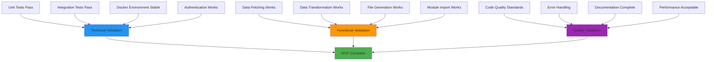

# Success Criteria: MVP Completion

**Document Version:** 1.0
**Phase:** MVP - Validation & Sign-off
**Last Updated:** 2025-01-10

## Overview

This document defines the exact criteria that must be met for MVP completion. Each criterion must be validated and signed off before proceeding to Phase 1. The MVP is considered complete only when ALL criteria are satisfied.

## Success Validation Framework



## Primary Success Criteria

### 1. Core Functionality ✅

#### 1.1 End-to-End Workflow
**Requirement:** Complete sync process from API to file generation

**Validation Commands:**
```bash
# Start environment
docker-compose up -d mock-api

# Execute sync
docker-compose run --rm api-sync node main.js

# Verify output
ls -la output/
cat output/account-specifications.js
```

**Success Criteria:**
- [ ] Sync completes without errors (exit code 0)
- [ ] Output file `account-specifications.js` is generated
- [ ] File contains valid JavaScript syntax
- [ ] File size > 1KB and < 100KB
- [ ] Process completes in < 30 seconds

#### 1.2 Data Accuracy
**Requirement:** Generated file contains correct data from API

**Validation Commands:**
```bash
# Compare API response with generated file
curl -H "Authorization: Bearer test-token-123" http://localhost:3001/api/account-specs > api-response.json

# Extract data from generated module
docker-compose run --rm api-sync node -e "
const mod = require('./output/account-specifications.js');
console.log(JSON.stringify(mod.accountSpecs, null, 2));
" > generated-data.json

# Manual comparison or automated validation
```

**Success Criteria:**
- [ ] All API data fields are present in generated file
- [ ] Data values match exactly (display_name, max_leverage, etc.)
- [ ] Array structure is preserved
- [ ] No data corruption or transformation errors

#### 1.3 Module Format
**Requirement:** Generated files are valid ES6 modules

**Validation Commands:**
```bash
# Test module import and structure
docker-compose run --rm api-sync node -e "
const mod = require('./output/account-specifications.js');
console.log('accountSpecs type:', typeof mod.accountSpecs);
console.log('metadata type:', typeof mod.metadata);
console.log('data length:', mod.accountSpecs.data.length);
console.log('metadata keys:', Object.keys(mod.metadata));
"
```

**Success Criteria:**
- [ ] Module exports `accountSpecs` constant
- [ ] Module exports `metadata` constant
- [ ] accountSpecs contains the API data structure
- [ ] metadata contains timestamp, source, generator, version
- [ ] Generated comments and usage examples are present

### 2. Authentication & Security ✅

#### 2.1 Bearer Token Authentication
**Requirement:** Proper authentication handling

**Validation Commands:**
```bash
# Test valid authentication
API_AUTH_TOKEN=test-token-123 docker-compose run --rm api-sync node main.js

# Test invalid authentication (should fail)
API_AUTH_TOKEN=wrong-token docker-compose run --rm api-sync node main.js

# Test missing token (should fail)
docker-compose run --rm api-sync sh -c "unset API_AUTH_TOKEN && node main.js"
```

**Success Criteria:**
- [ ] Valid token: Sync succeeds with 200 response
- [ ] Invalid token: Sync fails with authentication error
- [ ] Missing token: Sync fails with environment variable error
- [ ] Error messages are clear and actionable
- [ ] No token leakage in logs or output

#### 2.2 API Error Handling
**Requirement:** Graceful handling of API errors

**Validation Commands:**
```bash
# Test network errors
API_BASE_URL=http://nonexistent:9999 docker-compose run --rm api-sync node main.js

# Test API server errors (if mock API supports it)
# Test timeout scenarios
```

**Success Criteria:**
- [ ] Network errors produce appropriate error messages
- [ ] Application exits with non-zero code on failure
- [ ] Error stack traces are logged for debugging
- [ ] No partial/corrupted files are generated on error

### 3. Testing Validation ✅

#### 3.1 Unit Test Coverage
**Requirement:** All unit tests pass

**Validation Commands:**
```bash
# Run all unit tests
docker-compose run --rm api-sync npm test

# Run specific test suites
docker-compose run --rm api-sync npm test -- fetcher.test.js
docker-compose run --rm api-sync npm test -- transformer.test.js
```

**Success Criteria:**
- [ ] All fetcher tests pass (authentication, error handling, data fetching)
- [ ] All transformer tests pass (JSON to JS, camelCase, file saving)
- [ ] Test coverage > 80% for core modules
- [ ] Tests run without warnings or errors
- [ ] Test execution time < 60 seconds

#### 3.2 Integration Testing
**Requirement:** End-to-end integration tests pass

**Validation Commands:**
```bash
# Run integration test suite
docker-compose run --rm api-sync npm test -- integration.test.js

# Manual integration validation
docker-compose up -d
sleep 10
docker-compose run --rm api-sync node main.js
```

**Success Criteria:**
- [ ] Integration tests pass in Docker environment
- [ ] Mock API communication works correctly
- [ ] File generation is validated end-to-end
- [ ] Authentication scenarios are tested
- [ ] Performance requirements are met

### 4. Docker Environment ✅

#### 4.1 Container Stability
**Requirement:** Docker services are stable and reliable

**Validation Commands:**
```bash
# Test container builds
docker-compose build

# Test service startup
docker-compose up -d

# Test service health
curl http://localhost:3001/health
docker-compose ps

# Test service communication
docker-compose run --rm api-sync ping mock-api
```

**Success Criteria:**
- [ ] All containers build without errors
- [ ] Mock API starts and passes health checks
- [ ] Main application container starts successfully
- [ ] Inter-service communication works
- [ ] Services restart cleanly after failure

#### 4.2 Volume and Network Configuration
**Requirement:** File output and networking work correctly

**Validation Commands:**
```bash
# Test volume mounting
docker-compose run --rm api-sync ls -la output/
docker-compose run --rm api-sync touch output/test-file
ls output/

# Test network connectivity
docker-compose run --rm api-sync nslookup mock-api
docker-compose run --rm api-sync curl http://mock-api:3001/health
```

**Success Criteria:**
- [ ] Output directory is mounted correctly
- [ ] Files created in container appear on host
- [ ] Network resolution works (mock-api hostname)
- [ ] HTTP communication works between services
- [ ] Volume permissions are correct

### 5. Performance Requirements ✅

#### 5.1 Execution Time
**Requirement:** Acceptable performance for MVP

**Validation Commands:**
```bash
# Measure execution time
time docker-compose run --rm api-sync node main.js

# Multiple runs for consistency
for i in {1..5}; do
  echo "Run $i:"
  time docker-compose run --rm api-sync node main.js
done
```

**Success Criteria:**
- [ ] Sync completes in < 30 seconds consistently
- [ ] Cold start (first run) < 60 seconds
- [ ] Subsequent runs < 20 seconds
- [ ] No memory leaks over multiple runs

#### 5.2 Resource Usage
**Requirement:** Reasonable resource consumption

**Validation Commands:**
```bash
# Monitor resource usage
docker stats --no-stream

# Run sync while monitoring
docker-compose run --rm api-sync node main.js &
docker stats --no-stream
```

**Success Criteria:**
- [ ] Mock API memory usage < 100MB
- [ ] Main application memory usage < 200MB
- [ ] CPU usage returns to baseline after sync
- [ ] No excessive disk I/O
- [ ] Generated file size is reasonable (< 10MB)

## Quality Assurance Criteria

### 6. Code Quality ✅

#### 6.1 Code Standards
**Requirement:** Code follows best practices

**Manual Review Checklist:**
- [ ] Functions are pure where possible
- [ ] Single responsibility principle followed
- [ ] Error handling is consistent
- [ ] No hardcoded values (use environment variables)
- [ ] Meaningful variable and function names
- [ ] Proper module structure and exports

#### 6.2 Error Messages
**Requirement:** Clear and actionable error messages

**Validation:**
- [ ] Authentication errors explain the issue clearly
- [ ] Network errors provide helpful context
- [ ] File system errors indicate the problem
- [ ] Stack traces are available for debugging
- [ ] Error messages don't expose sensitive information

### 7. Documentation Quality ✅

#### 7.1 Documentation Completeness
**Requirement:** All documentation is complete and accurate

**Checklist:**
- [ ] README.md provides clear overview
- [ ] docker-setup.md has complete architecture
- [ ] implementation-roadmap.md has step-by-step guide
- [ ] testing-guide.md covers all test scenarios
- [ ] success-criteria.md (this document) is comprehensive

#### 7.2 Usage Instructions
**Requirement:** Clear instructions for setup and usage

**Validation:**
- [ ] Someone can follow the docs to set up MVP
- [ ] All commands are tested and work
- [ ] Troubleshooting guides are helpful
- [ ] Examples are accurate and complete

## Acceptance Testing Scenarios

### Scenario 1: Fresh Environment Setup
**Goal:** Validate complete setup from scratch

**Steps:**
1. Clone/create project structure
2. Follow docker-setup.md exactly
3. Run through implementation-roadmap.md
4. Execute all validation commands
5. Verify all success criteria are met

**Acceptance:** All steps complete without errors, MVP functions as designed

### Scenario 2: Error Recovery
**Goal:** Validate error handling and recovery

**Steps:**
1. Test with invalid authentication
2. Test with network failures
3. Test with missing environment variables
4. Test with filesystem errors
5. Verify appropriate error messages and exit codes

**Acceptance:** All error scenarios are handled gracefully

### Scenario 3: Multiple Executions
**Goal:** Validate consistency and reliability

**Steps:**
1. Run sync process 10 times
2. Verify output is consistent each time
3. Check for memory leaks or performance degradation
4. Validate file overwrite behavior

**Acceptance:** Consistent results across multiple executions

## Sign-off Checklist

### Technical Sign-off
- [ ] **All unit tests pass** - Verified by: ________________ Date: ________
- [ ] **Integration tests pass** - Verified by: ________________ Date: ________
- [ ] **Manual testing complete** - Verified by: ________________ Date: ________
- [ ] **Docker environment stable** - Verified by: ________________ Date: ________
- [ ] **Performance requirements met** - Verified by: ________________ Date: ________

### Functional Sign-off
- [ ] **End-to-end workflow works** - Verified by: ________________ Date: ________
- [ ] **Data accuracy validated** - Verified by: ________________ Date: ________
- [ ] **Authentication working** - Verified by: ________________ Date: ________
- [ ] **Error handling appropriate** - Verified by: ________________ Date: ________
- [ ] **Module format correct** - Verified by: ________________ Date: ________

### Quality Sign-off
- [ ] **Code quality standards met** - Verified by: ________________ Date: ________
- [ ] **Documentation complete** - Verified by: ________________ Date: ________
- [ ] **Test coverage adequate** - Verified by: ________________ Date: ________
- [ ] **Error messages clear** - Verified by: ________________ Date: ________
- [ ] **Best practices followed** - Verified by: ________________ Date: ________

## Final Validation Commands

Run these commands as the final validation before MVP sign-off:

```bash
# 1. Clean environment
docker-compose down --volumes
docker system prune -f

# 2. Full setup and validation
docker-compose up --build -d mock-api
sleep 10

# 3. Health check
curl http://localhost:3001/health

# 4. Authentication test
curl -H "Authorization: Bearer test-token-123" http://localhost:3001/api/account-specs

# 5. Run sync
docker-compose run --rm api-sync node main.js

# 6. Validate output
ls -la output/
head -20 output/account-specifications.js

# 7. Test module import
docker-compose run --rm api-sync node -e "
const mod = require('./output/account-specifications.js');
console.log('✅ Module loaded successfully');
console.log('Records:', mod.accountSpecs.data.length);
console.log('Timestamp:', mod.metadata.timestamp);
"

# 8. Run full test suite
docker-compose run --rm api-sync npm test

# 9. Performance test
time docker-compose run --rm api-sync node main.js

# 10. Clean up
docker-compose down
```

**Expected Result:** All commands complete successfully with appropriate output.

## MVP Completion Statement

**MVP is considered COMPLETE when:**

1. ✅ All technical criteria are validated and signed off
2. ✅ All functional criteria are validated and signed off
3. ✅ All quality criteria are validated and signed off
4. ✅ Final validation commands pass successfully
5. ✅ Documentation is complete and accurate
6. ✅ Code is committed to version control
7. ✅ Demo can be successfully presented

**Date of Completion:** ________________
**Completed by:** ________________
**Approved by:** ________________

## Next Steps After MVP

Once MVP is complete:

1. **Phase 1 Planning** - Begin GitHub Actions integration design
2. **Cloudflare Setup** - Prepare CDN deployment configuration
3. **Production Planning** - Design production environment requirements
4. **Stakeholder Demo** - Present working MVP to stakeholders
5. **Feedback Collection** - Gather input for Phase 1 priorities

**The MVP has successfully proven the concept. The system can fetch API data, transform it to JavaScript modules, and save files locally with proper authentication and error handling. This foundation is ready for automation and CDN deployment in Phase 1.**
