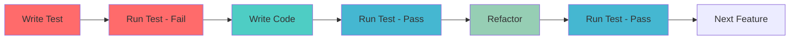
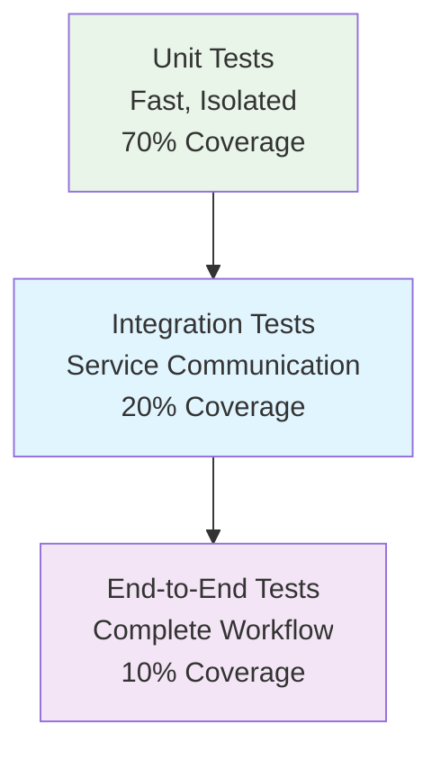

# Testing Guide: MVP Implementation

**Document Version:** 1.0
**Phase:** MVP - Testing Strategy & Validation
**Last Updated:** 2025-01-10

## Overview

This document provides comprehensive testing strategies, validation procedures, and troubleshooting guidance for the MVP implementation. The testing approach follows TDD principles and ensures both functional correctness and production readiness.

## Testing Strategy

### Test-Driven Development (TDD) Approach



### Testing Pyramid



## Unit Testing

### Test Environment Setup

#### Docker Test Environment
```bash
# Test environment variables
cat > .env.test << EOF
API_AUTH_TOKEN=test-token-123
NODE_ENV=test
LOG_LEVEL=silent
EOF

# Test runner configuration
cat > jest.config.js << EOF
module.exports = {
  testEnvironment: 'node',
  setupFilesAfterEnv: ['<rootDir>/test/setup.js'],
  testMatch: ['<rootDir>/test/**/*.test.js'],
  verbose: true,
  collectCoverage: true,
  coverageDirectory: 'coverage',
  coverageReporters: ['text', 'html']
};
EOF
```

#### Test Setup File (`test/setup.js`)
```javascript
// Test environment setup
process.env.NODE_ENV = 'test';
process.env.API_AUTH_TOKEN = 'test-token-123';

// Global test utilities
global.testTimeout = 30000;

// Mock console in tests to reduce noise
global.console = {
  ...console,
  log: jest.fn(),
  error: console.error,
  warn: console.warn,
  info: jest.fn(),
  debug: jest.fn()
};

// Global test cleanup
afterEach(() => {
  jest.clearAllMocks();
});
```

### Fetcher Module Tests

#### Test Coverage Requirements
- ✅ Successful API calls with authentication
- ✅ Authentication failure handling
- ✅ Network error handling
- ✅ Timeout handling
- ✅ Response validation
- ✅ Environment variable validation

#### Comprehensive Test Suite (`test/fetcher.test.js`)
```javascript
const { fetchApiData } = require('../src/fetcher');
const axios = require('axios');

// Mock axios for isolated testing
jest.mock('axios');
const mockedAxios = axios;

describe('fetchApiData', () => {
  beforeEach(() => {
    jest.clearAllMocks();
    process.env.API_AUTH_TOKEN = 'test-token-123';
  });

  describe('successful requests', () => {
    test('should fetch data with valid authentication', async () => {
      const mockResponse = {
        status: 200,
        data: {
          data: [{ account: { specification: {} } }],
          metadata: { timestamp: '2025-01-10T00:00:00Z' }
        }
      };

      mockedAxios.get.mockResolvedValue(mockResponse);

      const config = {
        apiBaseUrl: 'http://mock-api:3001',
        path: '/api/account-specs'
      };

      const result = await fetchApiData(config);

      expect(result).toEqual(mockResponse.data);
      expect(mockedAxios.get).toHaveBeenCalledWith(
        'http://mock-api:3001/api/account-specs',
        {
          headers: {
            'Authorization': 'Bearer test-token-123',
            'Content-Type': 'application/json'
          },
          timeout: 10000
        }
      );
    });

    test('should handle different API base URLs', async () => {
      const mockResponse = { status: 200, data: { data: [] } };
      mockedAxios.get.mockResolvedValue(mockResponse);

      const config = {
        apiBaseUrl: 'https://api.example.com',
        path: '/v1/data'
      };

      await fetchApiData(config);

      expect(mockedAxios.get).toHaveBeenCalledWith(
        'https://api.example.com/v1/data',
        expect.any(Object)
      );
    });
  });

  describe('authentication handling', () => {
    test('should throw error when API_AUTH_TOKEN is missing', async () => {
      delete process.env.API_AUTH_TOKEN;

      const config = {
        apiBaseUrl: 'http://mock-api:3001',
        path: '/api/account-specs'
      };

      await expect(fetchApiData(config)).rejects.toThrow(
        'API_AUTH_TOKEN environment variable is required'
      );
    });

    test('should handle 401 authentication errors', async () => {
      const mockError = {
        response: {
          status: 401,
          data: { error: 'Invalid token' }
        }
      };

      mockedAxios.get.mockRejectedValue(mockError);

      const config = {
        apiBaseUrl: 'http://mock-api:3001',
        path: '/api/account-specs'
      };

      await expect(fetchApiData(config)).rejects.toThrow(
        'Authentication failed: Invalid token'
      );
    });
  });

  describe('error handling', () => {
    test('should handle HTTP error responses', async () => {
      const mockError = {
        response: {
          status: 500,
          data: { error: 'Internal server error' }
        }
      };

      mockedAxios.get.mockRejectedValue(mockError);

      const config = {
        apiBaseUrl: 'http://mock-api:3001',
        path: '/api/account-specs'
      };

      await expect(fetchApiData(config)).rejects.toThrow(
        'API error (500): Internal server error'
      );
    });

    test('should handle network errors', async () => {
      const mockError = new Error('Network Error');
      mockedAxios.get.mockRejectedValue(mockError);

      const config = {
        apiBaseUrl: 'http://nonexistent-api:9999',
        path: '/api/test'
      };

      await expect(fetchApiData(config)).rejects.toThrow(
        'Network error: Network Error'
      );
    });

    test('should handle timeout errors', async () => {
      const mockError = new Error('timeout of 10000ms exceeded');
      mockedAxios.get.mockRejectedValue(mockError);

      const config = {
        apiBaseUrl: 'http://slow-api:3001',
        path: '/api/slow-endpoint'
      };

      await expect(fetchApiData(config)).rejects.toThrow(
        'Network error: timeout of 10000ms exceeded'
      );
    });
  });
});
```

### Transformer Module Tests

#### Test Coverage Requirements
- ✅ JSON to JavaScript transformation
- ✅ CamelCase conversion
- ✅ Metadata generation
- ✅ File saving with directory creation
- ✅ File overwriting
- ✅ Error handling for invalid inputs

#### Comprehensive Test Suite (`test/transformer.test.js`)
```javascript
const { transformToJS, saveToFile } = require('../src/transformer');
const fs = require('fs');
const path = require('path');
const os = require('os');

describe('transformToJS', () => {
  test('should convert JSON to valid ES6 module', () => {
    const inputData = {
      data: [
        {
          account: {
            specification: {
              display_name: 'Standard',
              max_leverage: 500
            }
          }
        }
      ]
    };

    const config = { name: 'account-specs' };
    const result = transformToJS(inputData, config);

    // Check module structure
    expect(result).toContain('export const accountSpecs');
    expect(result).toContain('export const metadata');

    // Check data content
    expect(result).toContain('"display_name": "Standard"');
    expect(result).toContain('"max_leverage": 500');

    // Check metadata
    expect(result).toContain('timestamp:');
    expect(result).toContain('source: "account-specs"');
    expect(result).toContain('generator: "api-to-cdn-sync"');
    expect(result).toContain('version: "1.0.0"');
  });

  test('should handle camelCase conversion correctly', () => {
    const testCases = [
      { input: 'account-specs', expected: 'accountSpecs' },
      { input: 'trading-instruments', expected: 'tradingInstruments' },
      { input: 'market-data', expected: 'marketData' },
      { input: 'single', expected: 'single' }
    ];

    testCases.forEach(({ input, expected }) => {
      const result = transformToJS({ data: [] }, { name: input });
      expect(result).toContain(`export const ${expected}`);
    });
  });

  test('should include usage example in output', () => {
    const result = transformToJS({ data: [] }, { name: 'test-data' });

    expect(result).toContain('// Usage example:');
    expect(result).toContain('import { testData, metadata }');
  });

  test('should handle empty data gracefully', () => {
    const result = transformToJS({ data: [] }, { name: 'empty-data' });

    expect(result).toContain('export const emptyData = {\n  "data": []\n};');
    expect(result).toContain('export const metadata');
  });

  test('should include generation timestamp', () => {
    const beforeTime = new Date().toISOString();
    const result = transformToJS({ data: [] }, { name: 'test' });
    const afterTime = new Date().toISOString();

    // Extract timestamp from result
    const timestampMatch = result.match(/timestamp: "([^"]+)"/);
    expect(timestampMatch).toBeTruthy();

    const timestamp = timestampMatch[1];
    expect(timestamp >= beforeTime).toBe(true);
    expect(timestamp <= afterTime).toBe(true);
  });
});

describe('saveToFile', () => {
  let testDir;

  beforeEach(() => {
    testDir = fs.mkdtempSync(path.join(os.tmpdir(), 'test-'));
  });

  afterEach(() => {
    if (fs.existsSync(testDir)) {
      fs.rmSync(testDir, { recursive: true });
    }
  });

  test('should create directories and save file', () => {
    const content = 'export const testData = [];';
    const filePath = path.join(testDir, 'nested', 'dir', 'file.js');

    saveToFile(content, filePath);

    expect(fs.existsSync(filePath)).toBe(true);
    expect(fs.readFileSync(filePath, 'utf8')).toBe(content);
  });

  test('should overwrite existing files', () => {
    const filePath = path.join(testDir, 'test.js');
    const content1 = 'export const data1 = [];';
    const content2 = 'export const data2 = [];';

    saveToFile(content1, filePath);
    expect(fs.readFileSync(filePath, 'utf8')).toBe(content1);

    saveToFile(content2, filePath);
    expect(fs.readFileSync(filePath, 'utf8')).toBe(content2);
  });

  test('should handle file permissions correctly', () => {
    const content = 'export const testData = [];';
    const filePath = path.join(testDir, 'test.js');

    saveToFile(content, filePath);

    const stats = fs.statSync(filePath);
    expect(stats.isFile()).toBe(true);
    expect(stats.size).toBe(content.length);
  });
});
```

## Integration Testing

### Docker Integration Tests

#### Test Environment Setup
```bash
# Start test environment
docker-compose -f docker-compose.test.yml up -d

# Run integration tests
docker-compose -f docker-compose.test.yml run --rm api-sync npm run test:integration
```

#### Integration Test Configuration (`docker-compose.test.yml`)
```yaml
version: '3.8'

services:
  mock-api:
    build:
      context: ./mock-api
      dockerfile: Dockerfile
    environment:
      - NODE_ENV=test
      - API_AUTH_TOKEN=test-token-123
    networks:
      - test-network
    healthcheck:
      test: ["CMD", "curl", "-f", "http://localhost:3001/health"]
      interval: 10s
      timeout: 5s
      retries: 3

  api-sync:
    build:
      context: ./src
      dockerfile: Dockerfile
    depends_on:
      mock-api:
        condition: service_healthy
    environment:
      - NODE_ENV=test
      - API_BASE_URL=http://mock-api:3001
      - API_AUTH_TOKEN=test-token-123
    volumes:
      - ./test:/app/test:ro
      - ./output:/app/output:rw
    networks:
      - test-network

networks:
  test-network:
    driver: bridge
```

#### Comprehensive Integration Test (`test/integration.test.js`)
```javascript
const { execSync } = require('child_process');
const fs = require('fs');
const path = require('path');

describe('End-to-End Integration Tests', () => {
  const outputDir = 'output';
  const outputFile = path.join(outputDir, 'account-specifications.js');

  beforeAll(() => {
    console.log('Setting up integration test environment...');

    // Wait for services to be ready
    const maxRetries = 30;
    let retries = 0;

    while (retries < maxRetries) {
      try {
        execSync('curl -f http://mock-api:3001/health', { stdio: 'ignore' });
        break;
      } catch (error) {
        retries++;
        if (retries >= maxRetries) {
          throw new Error('Mock API failed to start within timeout');
        }
        console.log(`Waiting for mock API... (${retries}/${maxRetries})`);
        execSync('sleep 2');
      }
    }
  });

  beforeEach(() => {
    // Clean output directory
    if (fs.existsSync(outputDir)) {
      fs.rmSync(outputDir, { recursive: true });
    }
  });

  describe('successful workflow', () => {
    test('should complete full sync process', async () => {
      console.log('Running full sync process...');

      // Execute main script
      const result = execSync('node main.js', {
        encoding: 'utf8',
        cwd: '/app'
      });

      console.log('Sync output:', result);

      // Verify output file exists
      expect(fs.existsSync(outputFile)).toBe(true);

      // Verify file content structure
      const content = fs.readFileSync(outputFile, 'utf8');

      // Check exports
      expect(content).toContain('export const accountSpecs');
      expect(content).toContain('export const metadata');

      // Check data content
      expect(content).toContain('"display_name": "Standard"');
      expect(content).toContain('"display_name": "Swap-Free"');
      expect(content).toContain('"max_leverage": 500');

      // Check metadata
      expect(content).toContain('timestamp:');
      expect(content).toContain('source: "account-specs"');

      console.log(`Generated file size: ${content.length} bytes`);
      console.log('✅ Integration test passed');
    });

    test('should generate valid JavaScript module', async () => {
      // Run sync
      execSync('node main.js', { cwd: '/app' });

      // Test that generated module can be imported
      const testScript = `
        const mod = require('./output/account-specifications.js');
        console.log('Data records:', mod.accountSpecs.data.length);
        console.log('Metadata timestamp:', mod.metadata.timestamp);
        console.log('Metadata source:', mod.metadata.source);

        // Validate structure
        if (!mod.accountSpecs || !mod.metadata) {
          throw new Error('Invalid module structure');
        }

        if (!Array.isArray(mod.accountSpecs.data)) {
          throw new Error('Data is not an array');
        }

        console.log('✅ Module validation passed');
      `;

      const result = execSync(`node -e "${testScript}"`, {
        encoding: 'utf8',
        cwd: '/app'
      });

      expect(result).toContain('Module validation passed');
    });
  });

  describe('error handling', () => {
    test('should handle authentication failure', async () => {
      // Set invalid token
      process.env.API_AUTH_TOKEN = 'invalid-token';

      try {
        execSync('node main.js', {
          encoding: 'utf8',
          cwd: '/app',
          env: { ...process.env, API_AUTH_TOKEN: 'invalid-token' }
        });

        // Should not reach here
        fail('Expected authentication to fail');
      } catch (error) {
        expect(error.message).toContain('Authentication failed');
        console.log('✅ Authentication failure handled correctly');
      }

      // Reset token
      process.env.API_AUTH_TOKEN = 'test-token-123';
    });

    test('should handle network errors gracefully', async () => {
      try {
        execSync('node main.js', {
          encoding: 'utf8',
          cwd: '/app',
          env: { ...process.env, API_BASE_URL: 'http://nonexistent-api:9999' }
        });

        fail('Expected network error');
      } catch (error) {
        expect(error.message).toContain('Network error');
        console.log('✅ Network error handled correctly');
      }
    });
  });

  describe('performance validation', () => {
    test('should complete sync within acceptable time', async () => {
      const startTime = Date.now();

      execSync('node main.js', { cwd: '/app' });

      const duration = Date.now() - startTime;
      console.log(`Sync completed in ${duration}ms`);

      // Should complete within 30 seconds
      expect(duration).toBeLessThan(30000);
    });

    test('should generate reasonable file size', async () => {
      execSync('node main.js', { cwd: '/app' });

      const stats = fs.statSync(outputFile);
      console.log(`Generated file size: ${stats.size} bytes`);

      // Should be at least 1KB but less than 100KB for test data
      expect(stats.size).toBeGreaterThan(1000);
      expect(stats.size).toBeLessThan(100000);
    });
  });
});
```

## Manual Testing Procedures

### Pre-Test Checklist
- [ ] Docker is running
- [ ] All containers are built
- [ ] Environment variables are set
- [ ] Output directory is clean

### Manual Test Scenarios

#### 1. Happy Path Testing
```bash
# Start services
docker-compose up -d mock-api

# Wait for health check
sleep 10

# Run sync
docker-compose run --rm api-sync node main.js

# Validate output
ls -la output/
cat output/account-specifications.js
```

**Expected Results:**
- Sync completes without errors
- Output file is generated
- File contains valid JavaScript
- Metadata is included

#### 2. Authentication Testing
```bash
# Test valid authentication
API_AUTH_TOKEN=test-token-123 docker-compose run --rm api-sync node main.js

# Test invalid authentication
API_AUTH_TOKEN=wrong-token docker-compose run --rm api-sync node main.js
```

**Expected Results:**
- Valid auth: Sync succeeds
- Invalid auth: Sync fails with authentication error

#### 3. Network Error Testing
```bash
# Test with non-existent API
API_BASE_URL=http://nonexistent:9999 docker-compose run --rm api-sync node main.js
```

**Expected Results:**
- Sync fails with network error
- Error message is clear and helpful

#### 4. Data Validation Testing
```bash
# Run sync and validate module
docker-compose run --rm api-sync node main.js

# Test module import
docker-compose run --rm api-sync node -e "
const mod = require('./output/account-specifications.js');
console.log('Records:', mod.accountSpecs.data.length);
console.log('Metadata:', JSON.stringify(mod.metadata, null, 2));
"
```

**Expected Results:**
- Module imports successfully
- Data structure is correct
- Metadata is present and valid

## Performance Testing

### Metrics to Monitor

#### Resource Usage
```bash
# Monitor container resources
docker stats api-sync-mock-api api-sync-main

# Monitor during sync
docker-compose run --rm api-sync node main.js &
docker stats --no-stream
```

#### Timing Benchmarks
```bash
# Measure sync time
time docker-compose run --rm api-sync node main.js

# Multiple runs for consistency
for i in {1..5}; do
  echo "Run $i:"
  time docker-compose run --rm api-sync node main.js
done
```

### Performance Acceptance Criteria
- **Sync Time**: < 30 seconds for test data
- **Memory Usage**: < 200MB per container
- **File Generation**: < 5 seconds
- **Network Requests**: < 10 seconds

## Troubleshooting Guide

### Common Test Failures

#### 1. Tests Not Running
**Symptoms:**
- `npm test` fails to start
- Jest not found errors

**Solutions:**
```bash
# Check jest installation
docker-compose run --rm api-sync npm list jest

# Reinstall dependencies
docker-compose run --rm api-sync npm install

# Check package.json test script
docker-compose run --rm api-sync cat package.json
```

#### 2. Mock API Connection Issues
**Symptoms:**
- Network errors in tests
- Connection refused errors

**Solutions:**
```bash
# Check mock API status
curl http://localhost:3001/health

# Check Docker network
docker network ls
docker network inspect api-sync-network

# Check service dependencies
docker-compose ps
```

#### 3. Authentication Failures
**Symptoms:**
- 401 Unauthorized errors
- Token validation failures

**Solutions:**
```bash
# Check environment variables
docker-compose run --rm api-sync env | grep API_AUTH_TOKEN

# Test authentication manually
curl -H "Authorization: Bearer test-token-123" http://localhost:3001/api/account-specs

# Verify token in mock API logs
docker-compose logs mock-api
```

#### 4. File Generation Issues
**Symptoms:**
- Output files not created
- Permission denied errors

**Solutions:**
```bash
# Check output directory
ls -la output/

# Check volume mounts
docker-compose config | grep -A5 volumes

# Check container permissions
docker-compose run --rm api-sync ls -la output/
```

### Debug Commands

#### Container Debugging
```bash
# Interactive shell
docker-compose run --rm api-sync sh

# Check file system
docker-compose run --rm api-sync ls -la

# Check environment
docker-compose run --rm api-sync env

# Check network connectivity
docker-compose run --rm api-sync ping mock-api
```

#### Log Analysis
```bash
# View all logs
docker-compose logs

# Follow logs in real-time
docker-compose logs -f

# Filter logs by service
docker-compose logs mock-api
docker-compose logs api-sync
```

#### Service Health Checks
```bash
# Check service status
docker-compose ps

# Check container health
docker inspect api-sync-mock-api | grep Health

# Test API endpoints
curl http://localhost:3001/health
curl -H "Authorization: Bearer test-token-123" http://localhost:3001/api/account-specs
```

## Test Data Management

### Mock Data Configuration

#### Sample Data Structure
The mock API serves consistent test data for reliable testing:

```json
{
  "data": [
    {
      "account": {
        "specification": {
          "display_name": "Standard",
          "information": "Trade CFDs with competitive spreads and swap fees.",
          "markets_offered": ["Forex", "Stock Indices", "Commodities"],
          "max_leverage": 500,
          "pips": 0.6
        }
      }
    }
  ]
}
```

#### Data Validation Rules
- All test data must be deterministic
- Response structure must match production API
- Authentication tokens must be consistent
- Timestamps should be mockable for testing

## Continuous Integration Preparation

### Pre-CI Checklist
- [ ] All unit tests pass locally
- [ ] Integration tests pass in Docker
- [ ] Manual testing scenarios completed
- [ ] Performance benchmarks met
- [ ] Error handling validated
- [ ] Documentation updated

### CI Test Commands
```bash
# Complete test suite
npm run test:all

# Individual test suites
npm run test:unit
npm run test:integration
npm run test:performance

# Test coverage
npm run test:coverage
```

The testing strategy ensures the MVP is robust, reliable, and ready for production deployment in Phase 1.
