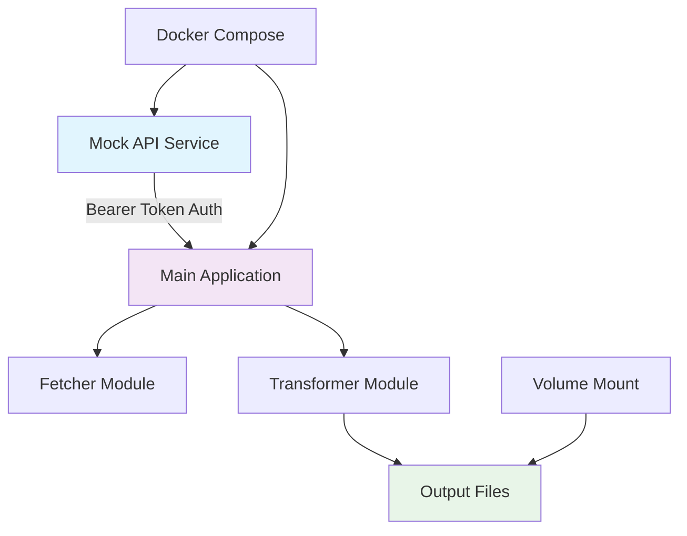

# MVP Documentation: API-to-CDN Sync

**Document Version:** 1.0
**Phase:** MVP - Local Docker Setup
**Branch:** `mvp/docs`
**Last Updated:** 2025-01-10

## Overview

This MVP documentation provides a complete roadmap for implementing the API-to-CDN sync proof of concept using Docker containers. The MVP proves the core concept: **Fetch → Transform → Save locally** with proper authentication and realistic API simulation.

## Architecture Overview



## Key Design Decisions

### Why Docker-Based Architecture?
- **Zero Local Dependencies**: No npm install required on host system
- **Production-Like Environment**: Realistic service communication
- **Easy Authentication Testing**: Proper Bearer token validation
- **Isolation**: Clean separation between mock API and application
- **Reproducible**: Consistent environment across different machines

### MVP Constraints
- **Single Endpoint**: Account specifications only
- **Manual Execution**: No automation or scheduling
- **Local File Output**: No CDN deployment
- **Basic Error Handling**: Simple try/catch patterns
- **Plain JavaScript**: No TypeScript or build processes

## Documentation Structure

| Document | Purpose |
|----------|---------|
| **[docker-setup.md](./docker-setup.md)** | Complete Docker architecture, services, and configuration |
| **[implementation-roadmap.md](./implementation-roadmap.md)** | Step-by-step plan to complete MVP with TDD approach |
| **[testing-guide.md](./testing-guide.md)** | Testing strategy, validation procedures, and troubleshooting |
| **[success-criteria.md](./success-criteria.md)** | Completion checklist and validation commands |

## Quick Start (After Implementation)

```bash
# 1. Start Docker services
docker-compose up --build

# 2. Run sync process
docker-compose run api-sync node main.js

# 3. Validate output
ls output/
cat output/account-specifications.js

# 4. Clean up
docker-compose down
```

## Success Metrics

### Primary Goals
- ✅ **Proof of Concept**: Core workflow functions end-to-end
- ✅ **Authentication**: Bearer token validation works
- ✅ **Data Transformation**: JSON → JavaScript module conversion
- ✅ **File Generation**: Valid ES6 modules with metadata

### Quality Gates
- All unit tests pass in Docker environment
- Integration test validates full workflow
- Manual execution generates valid output files
- Generated modules are importable and functional

## Next Steps After MVP

1. **Validate Success Criteria** - Ensure all checkpoints are met
2. **Request Phase 1 Approval** - Demo working MVP
3. **Transition to Phase 1** - Add GitHub Actions automation
4. **Cloudflare CDN Integration** - Deploy to global edge network

## Development Phases Reminder

- **MVP** ← **YOU ARE HERE** - Prove concept locally with Docker
- **Phase 1** - Add GitHub Actions + CDN deployment
- **Phase 2** - Add scheduling and reliability
- **Phase 3+** - Advanced features based on real usage

---

**Remember**: The goal is to deliver working software quickly and iterate based on real feedback. Start simple, prove it works, then evolve based on actual needs.
