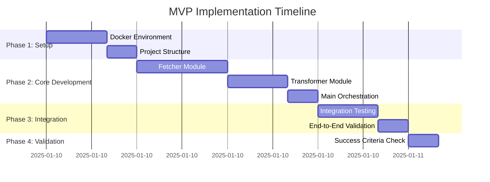

# Implementation Roadmap: MVP Completion

**Document Version:** 1.0
**Phase:** MVP - Step-by-Step Implementation Plan
**Last Updated:** 2025-01-10

## Overview

This document provides a complete step-by-step roadmap to implement the MVP using Test-Driven Development (TDD). Each step must be completed and validated before proceeding to the next.

## Implementation Phases



## Pre-Implementation Checklist

### System Requirements
- [ ] Docker installed and running
- [ ] Docker Compose available
- [ ] curl available for testing
- [ ] Text editor/IDE ready
- [ ] Terminal access

### Knowledge Prerequisites
- [ ] Basic Docker concepts
- [ ] JavaScript/Node.js fundamentals
- [ ] HTTP/REST API concepts
- [ ] Basic authentication (Bearer tokens)
- [ ] Test-Driven Development principles

## Phase 1: Environment Setup (4-6 hours)

### Step 1.1: Project Structure Creation
**Duration:** 30 minutes
**Goal:** Create complete project structure

```bash
# Create main project directory
mkdir api-to-cdn-sync
cd api-to-cdn-sync

# Create directory structure
mkdir -p mock-api/data
mkdir -p src
mkdir -p test
mkdir -p output

# Create placeholder files
touch docker-compose.yml
touch .env
touch mock-api/Dockerfile
touch mock-api/package.json
touch mock-api/server.js
touch mock-api/data/account-specs.json
touch src/Dockerfile
touch src/package.json
touch src/config.json
touch src/fetcher.js
touch src/transformer.js
touch src/main.js
touch test/fetcher.test.js
touch test/transformer.test.js
touch test/integration.test.js
```

**Validation:**
```bash
# Verify structure
tree api-to-cdn-sync/
# Should match the structure in docker-setup.md
```

### Step 1.2: Docker Configuration
**Duration:** 1 hour
**Goal:** Set up all Docker configuration files

**Tasks:**
1. Create `docker-compose.yml` (copy from docker-setup.md)
2. Create `.env` file with authentication token
3. Create `mock-api/Dockerfile`
4. Create `src/Dockerfile`

**Validation:**
```bash
# Validate docker-compose syntax
docker-compose config

# Should output valid YAML without errors
```

### Step 1.3: Mock API Implementation
**Duration:** 2 hours
**Goal:** Complete mock API service

**Tasks:**
1. Implement `mock-api/package.json`
2. Implement `mock-api/server.js` with authentication
3. Create `mock-api/data/account-specs.json` with sample data
4. Build and test mock API service

**Implementation Order:**
```bash
# 1. Copy package.json from docker-setup.md
# 2. Copy server.js from docker-setup.md
# 3. Copy account-specs.json from docker-setup.md
# 4. Test the service
```

**Validation:**
```bash
# Build and start mock API
docker-compose up --build mock-api

# Test health endpoint
curl http://localhost:3001/health

# Test auth endpoint
curl -H "Authorization: Bearer test-token-123" http://localhost:3001/api/account-specs

# Test invalid auth
curl -H "Authorization: Bearer wrong-token" http://localhost:3001/api/account-specs
```

**Expected Results:**
- Health endpoint returns 200 with JSON response
- Valid auth returns account specifications data
- Invalid auth returns 401 error

### Step 1.4: Main Application Setup
**Duration:** 1 hour
**Goal:** Set up main application structure

**Tasks:**
1. Create `src/package.json` with dependencies
2. Create `src/config.json` with API configuration
3. Create `src/Dockerfile`
4. Test main application container

**Validation:**
```bash
# Build main application
docker-compose build api-sync

# Test container can start
docker-compose run --rm api-sync node --version

# Should output Node.js version
```

## Phase 2: TDD Core Development (8-12 hours)

### Step 2.1: Fetcher Module (Test-First)
**Duration:** 6 hours
**Goal:** Implement HTTP client with authentication

#### Step 2.1.1: Write Fetcher Tests (2 hours)
**File:** `test/fetcher.test.js`

```javascript
const { fetchApiData } = require('../src/fetcher');

describe('fetchApiData', () => {
  test('should fetch data from valid URL with auth', async () => {
    const config = {
      apiBaseUrl: 'http://mock-api:3001',
      path: '/api/account-specs'
    };

    const result = await fetchApiData(config);

    expect(result).toBeDefined();
    expect(result.data).toBeInstanceOf(Array);
    expect(result.metadata).toBeDefined();
  });

  test('should handle authentication errors', async () => {
    // Mock invalid token scenario
    const originalToken = process.env.API_AUTH_TOKEN;
    process.env.API_AUTH_TOKEN = 'invalid-token';

    const config = {
      apiBaseUrl: 'http://mock-api:3001',
      path: '/api/account-specs'
    };

    await expect(fetchApiData(config)).rejects.toThrow();

    // Restore token
    process.env.API_AUTH_TOKEN = originalToken;
  });

  test('should handle network errors gracefully', async () => {
    const config = {
      apiBaseUrl: 'http://nonexistent-api:9999',
      path: '/api/test'
    };

    await expect(fetchApiData(config)).rejects.toThrow();
  });
});
```

**Validation:**
```bash
# Run tests (should fail - Red phase)
docker-compose run --rm api-sync npm test -- fetcher.test.js

# Expected: Tests fail because fetcher.js is empty
```

#### Step 2.1.2: Implement Fetcher (2 hours)
**File:** `src/fetcher.js`

```javascript
const axios = require('axios');

async function fetchApiData(config) {
  const url = `${config.apiBaseUrl}${config.path}`;
  const authToken = process.env.API_AUTH_TOKEN;

  if (!authToken) {
    throw new Error('API_AUTH_TOKEN environment variable is required');
  }

  try {
    console.log(`Fetching data from: ${url}`);

    const response = await axios.get(url, {
      headers: {
        'Authorization': `Bearer ${authToken}`,
        'Content-Type': 'application/json'
      },
      timeout: 10000 // 10 second timeout
    });

    console.log(`Successfully fetched data (${response.status})`);
    return response.data;

  } catch (error) {
    if (error.response?.status === 401) {
      throw new Error(`Authentication failed: ${error.response.data.error}`);
    }

    if (error.response?.status >= 400) {
      throw new Error(`API error (${error.response.status}): ${error.response.data?.error || error.message}`);
    }

    throw new Error(`Network error: ${error.message}`);
  }
}

module.exports = { fetchApiData };
```

**Validation:**
```bash
# Run tests (should pass - Green phase)
docker-compose run --rm api-sync npm test -- fetcher.test.js

# Expected: All tests pass
```

#### Step 2.1.3: Refactor Fetcher (2 hours)
**Goals:**
- Improve error handling
- Add request logging
- Add response validation
- Optimize performance

**Validation:**
```bash
# Run tests after refactoring
docker-compose run --rm api-sync npm test -- fetcher.test.js

# Expected: All tests still pass with better implementation
```

### Step 2.2: Transformer Module (Test-First)
**Duration:** 4 hours
**Goal:** Implement JSON to JavaScript transformation

#### Step 2.2.1: Write Transformer Tests (1.5 hours)
**File:** `test/transformer.test.js`

```javascript
const { transformToJS, saveToFile } = require('../src/transformer');
const fs = require('fs');
const path = require('path');

describe('transformToJS', () => {
  test('should convert JSON to ES6 module format', () => {
    const inputData = {
      data: [
        { account: { specification: { display_name: 'Test' } } }
      ]
    };

    const config = { name: 'account-specs' };

    const result = transformToJS(inputData, config);

    expect(result).toContain('export const accountSpecs');
    expect(result).toContain(JSON.stringify(inputData, null, 2));
    expect(result).toContain('export const metadata');
  });

  test('should handle camelCase conversion correctly', () => {
    const inputData = { data: [] };
    const config = { name: 'trading-instruments' };

    const result = transformToJS(inputData, config);

    expect(result).toContain('export const tradingInstruments');
  });

  test('should include metadata with timestamp', () => {
    const inputData = { data: [] };
    const config = { name: 'test-endpoint' };

    const result = transformToJS(inputData, config);

    expect(result).toContain('timestamp:');
    expect(result).toContain('source: "test-endpoint"');
  });
});

describe('saveToFile', () => {
  const testOutputDir = '/tmp/test-output';
  const testFile = path.join(testOutputDir, 'test-file.js');

  beforeEach(() => {
    // Clean up test directory
    if (fs.existsSync(testOutputDir)) {
      fs.rmSync(testOutputDir, { recursive: true });
    }
  });

  afterEach(() => {
    // Clean up test directory
    if (fs.existsSync(testOutputDir)) {
      fs.rmSync(testOutputDir, { recursive: true });
    }
  });

  test('should create directories and save file', () => {
    const content = 'export const testData = [];';

    saveToFile(content, testFile);

    expect(fs.existsSync(testFile)).toBe(true);
    expect(fs.readFileSync(testFile, 'utf8')).toBe(content);
  });

  test('should overwrite existing files', () => {
    const content1 = 'export const data1 = [];';
    const content2 = 'export const data2 = [];';

    saveToFile(content1, testFile);
    saveToFile(content2, testFile);

    expect(fs.readFileSync(testFile, 'utf8')).toBe(content2);
  });
});
```

**Validation:**
```bash
# Run tests (should fail - Red phase)
docker-compose run --rm api-sync npm test -- transformer.test.js

# Expected: Tests fail because transformer.js is empty
```

#### Step 2.2.2: Implement Transformer (2 hours)
**File:** `src/transformer.js`

```javascript
const fs = require('fs');
const path = require('path');

function transformToJS(data, config) {
  const varName = toCamelCase(config.name);
  const timestamp = new Date().toISOString();

  const jsContent = `// Generated on ${timestamp}
// Source: ${config.name}

export const ${varName} = ${JSON.stringify(data, null, 2)};

export const metadata = {
  timestamp: "${timestamp}",
  source: "${config.name}",
  generator: "api-to-cdn-sync",
  version: "1.0.0"
};

// Usage example:
// import { ${varName}, metadata } from './account-specifications.js';
// console.log('Data generated:', metadata.timestamp);
`;

  return jsContent;
}

function saveToFile(content, outputPath) {
  const dir = path.dirname(outputPath);

  // Create directory if it doesn't exist
  if (!fs.existsSync(dir)) {
    fs.mkdirSync(dir, { recursive: true });
    console.log(`Created directory: ${dir}`);
  }

  // Write file
  fs.writeFileSync(outputPath, content, 'utf8');
  console.log(`Saved file: ${outputPath} (${content.length} bytes)`);
}

function toCamelCase(str) {
  return str.replace(/-([a-z])/g, (_, letter) => letter.toUpperCase());
}

module.exports = { transformToJS, saveToFile };
```

**Validation:**
```bash
# Run tests (should pass - Green phase)
docker-compose run --rm api-sync npm test -- transformer.test.js

# Expected: All tests pass
```

#### Step 2.2.3: Refactor Transformer (0.5 hours)
**Goals:**
- Add input validation
- Improve error messages
- Add file size limits

### Step 2.3: Main Orchestration
**Duration:** 2 hours
**Goal:** Tie everything together

#### Step 2.3.1: Implement Main Script
**File:** `src/main.js`

```javascript
const { fetchApiData } = require('./fetcher');
const { transformToJS, saveToFile } = require('./transformer');
const config = require('./config');

async function main() {
  console.log('🚀 Starting API-to-CDN sync process...');
  console.log(`Timestamp: ${new Date().toISOString()}`);

  try {
    // Process single endpoint for MVP
    const endpoint = config.endpoints[0];
    console.log(`Processing endpoint: ${endpoint.name}`);

    // Step 1: Fetch data from API
    console.log('📡 Fetching data from API...');
    const apiData = await fetchApiData({
      apiBaseUrl: config.apiBaseUrl,
      path: endpoint.path
    });

    console.log(`✅ Successfully fetched ${apiData.data?.length || 0} records`);

    // Step 2: Transform data to JavaScript module
    console.log('🔄 Transforming data to JavaScript module...');
    const jsContent = transformToJS(apiData, endpoint);

    // Step 3: Save to output file
    console.log('💾 Saving to output file...');
    const outputPath = path.join('output', endpoint.outputFile);
    saveToFile(jsContent, outputPath);

    console.log('🎉 Sync process completed successfully!');
    console.log(`📄 Generated file: ${outputPath}`);

    // Display summary
    console.log('\n📊 Summary:');
    console.log(`- Endpoint: ${endpoint.name}`);
    console.log(`- Records: ${apiData.data?.length || 0}`);
    console.log(`- Output: ${outputPath}`);
    console.log(`- Size: ${jsContent.length} bytes`);

  } catch (error) {
    console.error('❌ Sync process failed:');
    console.error(`Error: ${error.message}`);

    if (error.stack) {
      console.error('\nStack trace:');
      console.error(error.stack);
    }

    process.exit(1);
  }
}

// Run if called directly
if (require.main === module) {
  main();
}

module.exports = { main };
```

**Validation:**
```bash
# Test main script
docker-compose run --rm api-sync node main.js

# Expected: Complete sync process with success message
```

## Phase 3: Integration Testing (4-6 hours)

### Step 3.1: Integration Test Implementation
**Duration:** 4 hours
**Goal:** Test complete end-to-end workflow

**File:** `test/integration.test.js`

```javascript
const { execSync } = require('child_process');
const fs = require('fs');
const path = require('path');

describe('End-to-End Integration', () => {
  const outputDir = 'output';
  const outputFile = path.join(outputDir, 'account-specifications.js');

  beforeEach(() => {
    // Clean output directory
    if (fs.existsSync(outputDir)) {
      fs.rmSync(outputDir, { recursive: true });
    }
  });

  test('should complete full sync workflow', async () => {
    // Execute main script
    const result = execSync('node main.js', {
      encoding: 'utf8',
      cwd: '/app'
    });

    // Verify output file exists
    expect(fs.existsSync(outputFile)).toBe(true);

    // Verify file content
    const content = fs.readFileSync(outputFile, 'utf8');
    expect(content).toContain('export const accountSpecs');
    expect(content).toContain('export const metadata');
    expect(content).toContain('timestamp:');

    // Verify data structure
    expect(content).toContain('"display_name": "Standard"');
    expect(content).toContain('"display_name": "Swap-Free"');

    console.log('✅ Integration test passed');
    console.log(`Generated file size: ${content.length} bytes`);
  });

  test('should handle authentication failure gracefully', async () => {
    // Set invalid token
    process.env.API_AUTH_TOKEN = 'invalid-token';

    // Execute main script and expect failure
    expect(() => {
      execSync('node main.js', {
        encoding: 'utf8',
        cwd: '/app'
      });
    }).toThrow();

    // Reset token
    process.env.API_AUTH_TOKEN = 'test-token-123';
  });
});
```

**Validation:**
```bash
# Run integration tests
docker-compose run --rm api-sync npm test -- integration.test.js

# Expected: All integration tests pass
```

### Step 3.2: End-to-End Manual Validation
**Duration:** 2 hours
**Goal:** Manual verification of complete workflow

**Validation Steps:**

1. **Start Complete Environment:**
```bash
# Start mock API
docker-compose up -d mock-api

# Wait for health check
sleep 10

# Verify API is healthy
curl http://localhost:3001/health
```

2. **Run Sync Process:**
```bash
# Execute sync
docker-compose run --rm api-sync node main.js

# Check output
ls -la output/
cat output/account-specifications.js
```

3. **Validate Generated Module:**
```bash
# Test module can be imported
docker-compose run --rm api-sync node -e "
const mod = require('./output/account-specifications.js');
console.log('Metadata:', mod.metadata);
console.log('Data records:', mod.accountSpecs.data.length);
"
```

4. **Test Authentication:**
```bash
# Test with valid token
API_AUTH_TOKEN=test-token-123 docker-compose run --rm api-sync node main.js

# Test with invalid token (should fail)
API_AUTH_TOKEN=wrong-token docker-compose run --rm api-sync node main.js
```

## Phase 4: Final Validation (2-3 hours)

### Step 4.1: Success Criteria Verification
**Duration:** 2 hours
**Goal:** Verify all MVP requirements are met

**Checklist:**
- [ ] All unit tests pass
- [ ] Integration tests pass
- [ ] Manual execution works
- [ ] Generated files are valid ES6 modules
- [ ] Authentication works correctly
- [ ] Error handling is appropriate
- [ ] Docker environment is stable

### Step 4.2: Performance Validation
**Duration:** 1 hour
**Goal:** Ensure acceptable performance

**Tests:**
```bash
# Measure sync time
time docker-compose run --rm api-sync node main.js

# Check resource usage
docker stats api-sync-mock-api
```

**Acceptance Criteria:**
- Sync completes in < 30 seconds
- Memory usage < 200MB per container
- Generated file is valid and readable

## Completion Checklist

### Technical Validation
- [ ] All unit tests pass (fetcher, transformer)
- [ ] Integration test passes
- [ ] Manual sync execution works
- [ ] Generated JavaScript module is valid
- [ ] Authentication validation works
- [ ] Error handling is appropriate
- [ ] Docker containers are stable

### Functional Validation
- [ ] API data is fetched correctly
- [ ] JSON to JavaScript transformation works
- [ ] Files are saved to correct location
- [ ] Module exports are accessible
- [ ] Metadata is included in output

### Quality Validation
- [ ] Code follows TDD principles
- [ ] Functions are pure where possible
- [ ] Error messages are clear
- [ ] Logging is appropriate
- [ ] Documentation is complete

## Troubleshooting Guide

### Common Implementation Issues

**1. Tests Not Running**
```bash
# Check test files exist
docker-compose run --rm api-sync ls test/

# Check jest is installed
docker-compose run --rm api-sync npm list jest
```

**2. Authentication Failures**
```bash
# Check environment variables
docker-compose run --rm api-sync env | grep API_AUTH_TOKEN

# Test API manually
curl -H "Authorization: Bearer test-token-123" http://localhost:3001/api/account-specs
```

**3. File Generation Issues**
```bash
# Check output directory permissions
docker-compose run --rm api-sync ls -la output/

# Check volume mount
docker-compose config | grep -A5 volumes
```

### Getting Help

If stuck on any step:
1. Check logs: `docker-compose logs`
2. Run debug shell: `docker-compose run --rm api-sync sh`
3. Verify network: `docker-compose run --rm api-sync ping mock-api`
4. Test components individually

## Next Steps After MVP

Once all validation passes:
1. **Document lessons learned**
2. **Request Phase 1 approval**
3. **Plan GitHub Actions integration**
4. **Prepare for CDN deployment**

The MVP proves the concept works. Phase 1 will add automation and deployment to Cloudflare CDN.
