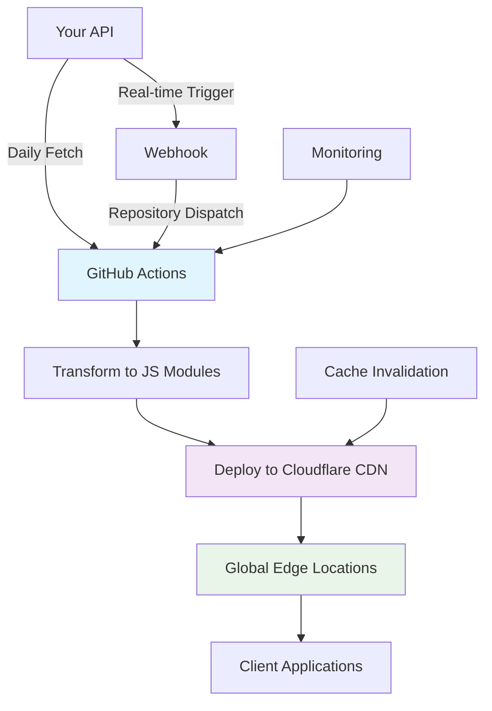

# API-to-CDN Requirements & Architecture

## Business Problem

Our business rules and configuration data are served via API endpoints but change infrequently (daily or less). Current API-based delivery results in:
- Increased latency for client applications
- Higher server load and costs
- Reduced performance for global users
- Unnecessary API calls for rarely-changing data

## Solution Requirements

### Functional Requirements
- **Data Freshness**: Daily automated updates (with future real-time capability)
- **Global Performance**: Sub-100ms response times worldwide
- **Scalability**: Handle 500+ requests/hour initially, scale to thousands
- **Reliability**: 99.9% uptime with automatic failover
- **Security**: Only public, non-sensitive data exposure

### Non-Functional Requirements
- **Simple Architecture**: Minimal infrastructure complexity
- **Cost Effective**: Lower operational costs than API serving
- **Future Extensible**: Easy to add new endpoints and features
- **Developer Friendly**: TypeScript/Node.js based tooling

## Architecture Overview

## Architecture Decisions

### Why GitHub Actions + Cloudflare CDN?

| Aspect | GitHub Actions | Cloudflare CDN | Alternatives Considered |
|--------|---------------|----------------|------------------------|
| **Automation** | ✅ Built-in scheduling, webhook triggers | ✅ Auto cache invalidation | Jenkins, AWS Lambda |
| **Performance** | ⚡ Fast build times | ✅ Global edge network | AWS CloudFront, Azure CDN |
| **Cost** | ✅ Free tier sufficient | ✅ Cost-effective bandwidth | Self-hosted, other CDNs |
| **Simplicity** | ✅ YAML configuration | ✅ Simple API integration | Complex container orchestration |
| **Extensibility** | ✅ Rich ecosystem | ✅ Advanced edge features | Limited customization |

### Data Flow Architecture

1. **Source**: API endpoints return JSON configuration
2. **Transform**: Convert JSON to optimized JavaScript modules
3. **Distribute**: Deploy to global CDN edge locations
4. **Consume**: Client applications import JS modules directly

## Development Phases

### MVP (2-3 days)
**Goal**: Prove core concept with simplest implementation
- Single endpoint support (account specifications)
- Manual execution (no automation)
- Local file generation only
- Basic fetch → transform → save workflow

### Phase 1: Basic Automation (1 week)
**Goal**: Add GitHub Actions and CDN deployment
- GitHub Actions workflow (manual trigger)
- Cloudflare CDN deployment
- Single endpoint support
- Basic success/failure notifications

### Phase 2: Scheduled Operations (1 week)
**Goal**: Add scheduling and reliability
- Daily automated updates
- Simple retry mechanisms
- Cache invalidation
- Improved logging

### Phase 3: Real-time Updates (1-2 weeks)
**Goal**: Enable immediate updates
- Webhook integration for API changes
- Repository dispatch triggers
- Faster deployment process

### Phase 4+: Advanced Features (As needed)
**Goal**: Add features based on real usage
- Multi-endpoint support
- Environment separation
- Analytics and monitoring
- Only implement when actually needed

## Success Metrics

### Performance Targets
- **Response Time**: < 100ms globally (vs 500ms+ API calls)
- **Availability**: > 99.9% uptime
- **Cache Hit Rate**: > 95%

### Operational Targets
- **Cost Reduction**: 60%+ lower than API serving costs
- **Server Load**: 80%+ reduction in API endpoint calls
- **Deployment Time**: < 5 minutes for updates

### Developer Experience
- **Setup Time**: < 30 minutes for new endpoints
- **Error Resolution**: < 15 minutes average incident response
- **Documentation**: Complete setup guide and troubleshooting

## Risk Mitigation

| Risk | Impact | Probability | Mitigation |
|------|--------|-------------|------------|
| CDN outage | High | Low | Multiple CDN fallback, API backup |
| GitHub Actions failure | Medium | Low | Monitoring, alerts, manual trigger |
| Data inconsistency | Medium | Medium | Validation, rollback capabilities |
| Cache poisoning | Low | Low | Cache validation, versioning |

## Technology Stack

- **Runtime**: Node.js 18+ with TypeScript
- **CI/CD**: GitHub Actions
- **CDN**: Cloudflare with global distribution
- **Monitoring**: GitHub Actions logs + Cloudflare Analytics
- **Security**: GitHub Secrets, Cloudflare API tokens
